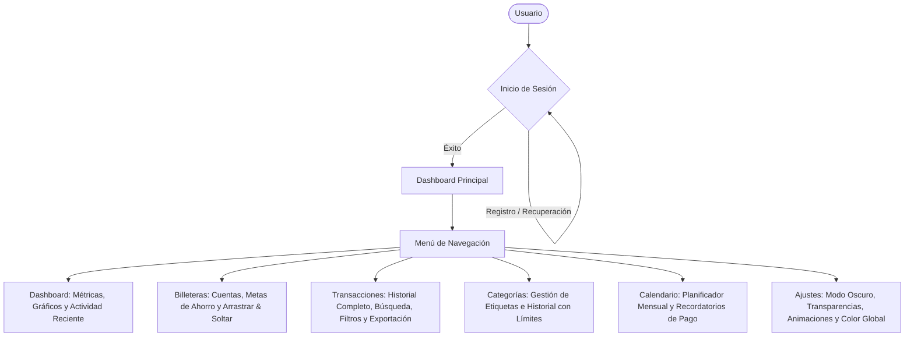

# Manual de Usuario Oficial: Ahorrito

¡Bienvenido a **Ahorrito**, tu plataforma premium de finanzas personales! Esta guía ha sido diseñada para proporcionarte una visión completa y profesional de todas las herramientas y configuraciones que Ahorrito pone a tu disposición para optimizar tu salud financiera.

---

## 1. Introducción y Flujo de Navegación

Ahorrito te permite gestionar tus cuentas (billeteras), hacer seguimiento a tus metas de ahorro, clasificar y limitar tus gastos, programar recordatorios de vencimiento en un calendario interactivo y personalizar visualmente la interfaz de acuerdo al rendimiento de tu dispositivo.

### Arquitectura de Navegación

El siguiente diagrama detalla cómo interactúan los distintos módulos de la aplicación:

---

## 2. Registro y Acceso Seguro

Para comenzar a utilizar Ahorrito, es indispensable crear una cuenta personal. Esto garantiza que todos tus datos financieros permanezcan aislados y protegidos de forma segura.

### Registro de Usuario
1. En la pantalla inicial, haz clic en **Regístrate aquí**.
2. Completa los campos solicitados: **Usuario** y **Contraseña** (asegúrate de que sea robusta).
3. Haz clic en **Crear Cuenta**.

### Recuperación de Contraseña
Si olvidas tus credenciales:
1. En la pantalla de inicio de sesión, selecciona **¿Olvidaste tu contraseña?**.
2. Ingresa tu usuario registrado para solicitar el inicio del proceso de restablecimiento seguro mediante los canales habilitados.

---

## 3. Dashboard Principal (Panel de Control)

El Dashboard es tu centro de operaciones. Al ingresar, se te presentará un resumen visual e inmediato del estado de tus finanzas.

### Métricas Clave
*   **Balance Total:** Representa la suma agregada de los saldos de todas tus billeteras activas (excluyendo metas de ahorro).
*   **Ahorros Acumulados:** Dinero total que has apartado en tus cuentas destinadas a objetivos específicos.
*   **Gastos del Mes:** La suma del dinero egresado durante el mes calendario en curso, detallando la cantidad de consumos.
*   **Ingresos del Mes:** El monto total de dinero ingresado en el mes, detallando la cantidad de transacciones registradas.

### Visualización Gráfica Interactiva
*   **Consumos por Categorías:** Gráfico tipo *Doughnut* que ilustra porcentualmente en qué estás gastando más, facilitando la identificación de fugas de dinero.
*   **Comparativa Mensual:** Gráfico de barras que compara de manera histórica tus ingresos contra tus gastos del mes corriente.
*   **Actividades Recientes:** Una lista compacta de las últimas transacciones realizadas para una auditoría rápida.

---

## 4. Billeteras (Carteras) y Metas de Ahorro

Este panel te permite modelar tus cuentas bancarias, efectivo, tarjetas y, de forma separada, tus alcancías digitales o metas.

### Gestión de Billeteras
*   **Nueva Billetera:** Haz clic en **Nueva billetera**, ingresa el nombre de la cuenta (Ej. "Efectivo", "Banco Galicia"), el saldo inicial y selecciona un color característico o introduce un código hexadecimal específico (`#HEX`).
*   **Modificar Orden (Arrastrar y Soltar):** Puedes reorganizar tus billeteras arrastrándolas con el ratón. Esto te permite colocar tus cuentas de uso más frecuente al principio de la lista.

### Objetivos y Metas de Ahorro
*   **Nuevo Objetivo:** Haz clic en **Nuevo objetivo**. A diferencia de las billeteras comunes, aquí deberás definir un **Monto Objetivo** (la meta que deseas alcanzar). La tarjeta mostrará una barra de progreso que indica el porcentaje de avance respecto a tu meta en base a los fondos asignados.

---

## 5. Transacciones (Registros de Dinero)

El registro preciso de tus movimientos es fundamental para que los gráficos y balances sean útiles.

### Registrar una Nueva Transacción
1. Haz clic en el botón flotante **Nueva Transacción** en la barra superior o en el atajo correspondiente.
2. Configura los siguientes campos obligatorios:
    *   **Tipo de Operación:** Gasto (Resta de la cuenta), Ingreso (Suma a la cuenta), o Ahorro (Suma a una meta de ahorro).
    *   **Monto:** El valor numérico de la transacción.
    *   **Descripción:** Detalle corto del movimiento (máximo 100 caracteres).
    *   **Fecha:** Día en que se realizó la operación.
    *   **Cartera / Cuenta Afectada:** La billetera de donde sale o a donde ingresa el dinero.
    *   **Categoría:** Requerido únicamente para los Gastos, permitiendo agrupar tus consumos (Ej. Comida, Alquiler).

### Historial y Filtros Avanzados
En el panel de **Transacciones** dispones de filtros en tiempo real:
*   **Buscador:** Encuentra registros instantáneamente escribiendo palabras clave en la descripción.
*   **Filtro por Tipo y Cuenta:** Limita la vista a un tipo específico de operación o a una única billetera.
*   **Ordenamiento:** Clasifica los registros por fecha (más recientes/antiguos) o monto (mayor/menor).

---

## 6. Categorías y Límites de Gasto

Las categorías te permiten estructurar tus finanzas personales y, lo más importante, poner un freno al consumo excesivo.

### Configurar Límites de Gasto
*   Al crear o editar una categoría, puedes establecer un **Límite de Gasto Mensual**.
*   Si tus transacciones de gasto bajo esa categoría superan el límite establecido durante el mes corriente, el sistema disparará alertas visuales y te notificará que has excedido tu presupuesto planificado.

---

## 7. Calendario y Recordatorios

El planificador integrado te ayuda a evitar el olvido de facturas, vencimientos de tarjetas de crédito o cobros pendientes.

### Programar un Recordatorio
1. Selecciona un día del calendario.
2. En la barra lateral derecha, haz clic en **Nuevo Recordatorio**.
3. Elige el **Título**, la **Clasificación** (Pago/Vencimiento, Recordatorio, Meta u Otro) y opcionalmente añade notas adicionales (máximo 150 caracteres).
4. El día del vencimiento, el calendario mostrará un indicador de color asociado al tipo de recordatorio para llamar tu atención.

---

## 8. Ajustes y Personalización Avanzada

Ahorrito cuenta con un panel de personalización premium accesible desde el icono de configuración (`settings`) en la parte inferior del menú lateral.

### Opciones de Personalización y Rendimiento
*   **Modo Oscuro / Claro:** Alterna entre una interfaz elegante de cristal nocturno o un modo día de alta claridad.
*   **Transparencias (Optimización):** Desactiva los filtros de difuminado (`backdrop-filter`) para mejorar drásticamente el rendimiento visual en dispositivos móviles antiguos o computadoras con procesadores de gama baja.
*   **Animaciones:** Apaga las transiciones y efectos dinámicos de las tarjetas para agilizar la fluidez de navegación y ahorrar batería.
*   **Color de Acento Global:** Cambia el tono de identidad del sistema. Puedes elegir entre los presets (Oro, Esmeralda, Zafiro, Amatista, Rosa) o ingresar tu propio color favorito escribiendo su código en formato hexadecimal.

---

## 9. Buenas Prácticas Recomendadas

Para obtener el máximo beneficio de Ahorrito, te sugerimos seguir estas pautas:
1.  **Registros Diarios:** Dedica 2 minutos al final del día para registrar tus gastos pequeños (gastos hormiga).
2.  **Definición de Límites Realistas:** Analiza tus gráficos del mes anterior antes de imponer límites de gasto muy estrictos a tus categorías.
3.  **Alertas de Pago:** Revisa el Calendario los lunes por la mañana para anticiparte a las facturas y obligaciones de la semana.
